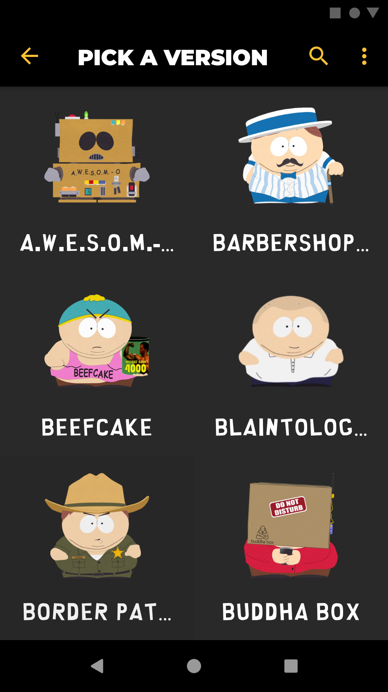

# Cartman Soundboard
The official repository for the most comprehensive Cartman soundboard.

  

The Cartman Soundboard is the definitive hub for true Eric Cartman fans!

Listen to over 700 audio clips of Eric Cartman, spanning the first 23 seasons of South Park.

Instantly playback your favourite Eric Cartman quotes with on-demand audio clips.

Explore the depths of the South Park universe by going through your favorite Eric Cartman alter-egos such as "A.W.E.S.O.M.-O 4000", "The Coon", "Hennifer Lopez", "The Dawg", and many more.

Find quotes or songs by using the search tool to find exactly what you are looking for.

You can also long-press any audio clip to do any of the following actions:

-	Add audio clips to your list of favourites
-	Share audio clips
-	Set audio clips as ringtones, notification tones, and alarm tones
-	Display the full title and duration of audio clips

## Download the Cartman Soundboard

The Cartman Soundboard can be downloaded from any of the following locations:

Or through [Direct Download (v1.0.0)](https://github.com/soundbytesdotme/cartman-south-park-soundboard/releases/download/v1.0.0/cartman-south-park-soundboard-1.0.0.apk) via this repo's [releases](https://github.com/soundbytesdotme/cartman-south-park-soundboard/releases) page.

When downloading from either location, check the URL bar of your browser to ensure you are in the correct place and not visiting a phishing link.

### Releases

All version releases of the app can be found at the releases section of this repo: https://github.com/soundbytesdotme/cartman-south-park-soundboard/releases.
